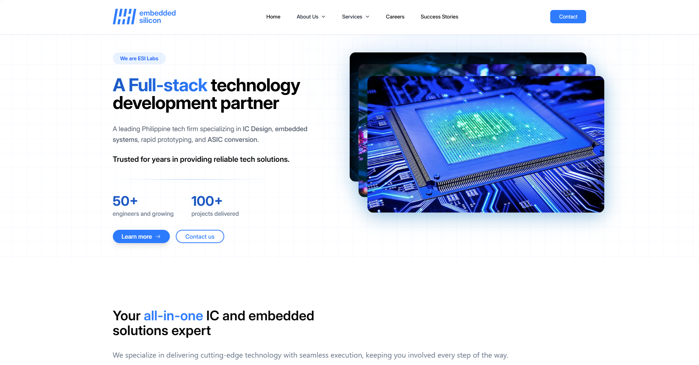
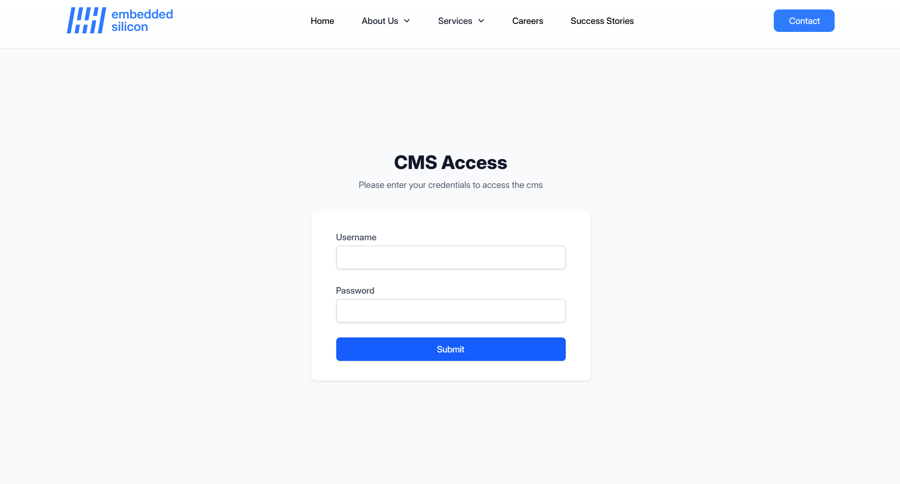
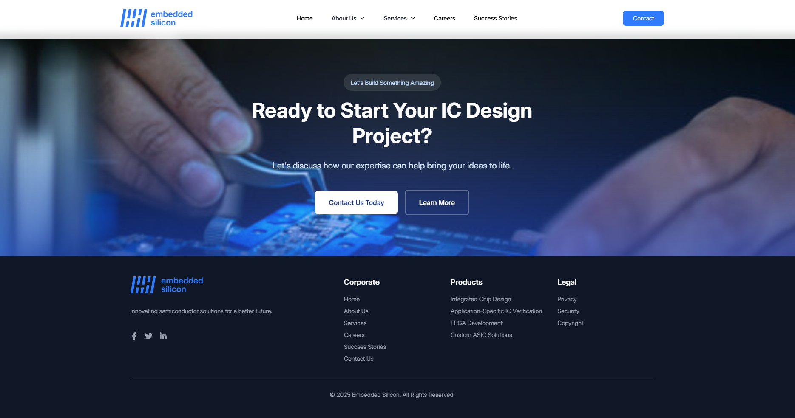
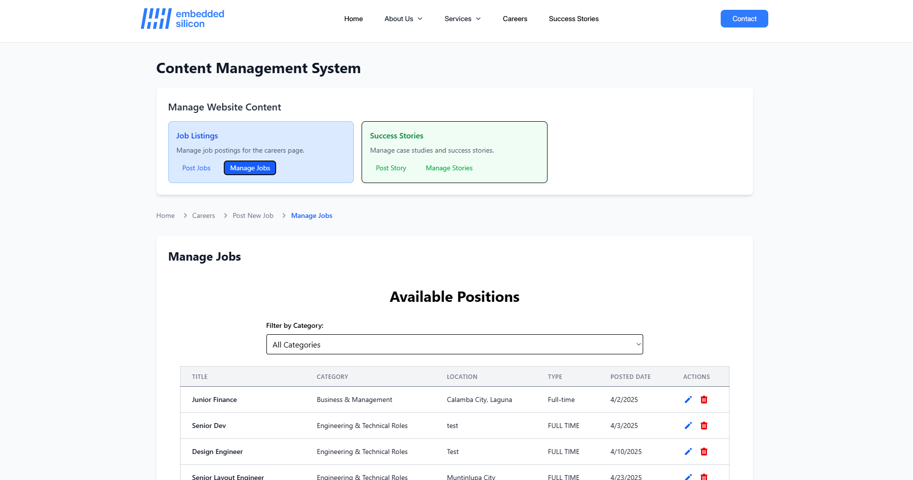
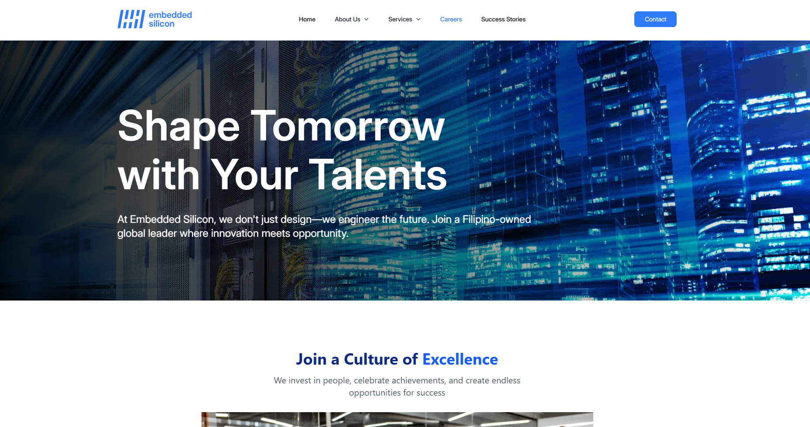

# 🌐 Embedded Silicon Website Revamp

We undertook a complete revamp of Embedded Silicon’s old website using the MERN stack, following the Software Development Life Cycle (SDLC) process. While the updated version brings a more modern look and improved responsiveness across devices, there are still enhancements to be made and additional features planned for future development.

## 🧑‍💻 Project Role

Led the development as part of a two-person on-the-job training (OJT) team. Took charge of both frontend and backend development, including custom CMS integration.

## 🔧 Tech Stack

- **Frontend**: React.js, Tailwind CSS, DaisyUI, Framer Motion
- **Backend**: Node.js, Express.js
- **Database**: MongoDB
- **Content Management**: Custom-built CMS for job listings & success stories
- **Deployment**: Vercel / Render (update with your actual host)

## 🚀 Key Features

- 🖥️ **Responsive Design** – Optimized for desktop, and mobile
- 🧑‍💼 **Dynamic Job Listings** – Easily updatable via the CMS
- 📚 **Success Stories Section** – Showcasing client and team achievements
- 🧠 **CMS Dashboard** – Built-in admin tools for non-tech staff to manage content

## 📸 Screenshots

| Home Page | Admin CMS | Job Listings |
|-----------|-----------|--------------|
|  |  |  |
|  |  |  |

## 🛠️ Local Setup

Clone the repository:

```bash
git clone https://github.com/your-username/embedded-silicon-website.git
cd embedded-silicon-website
