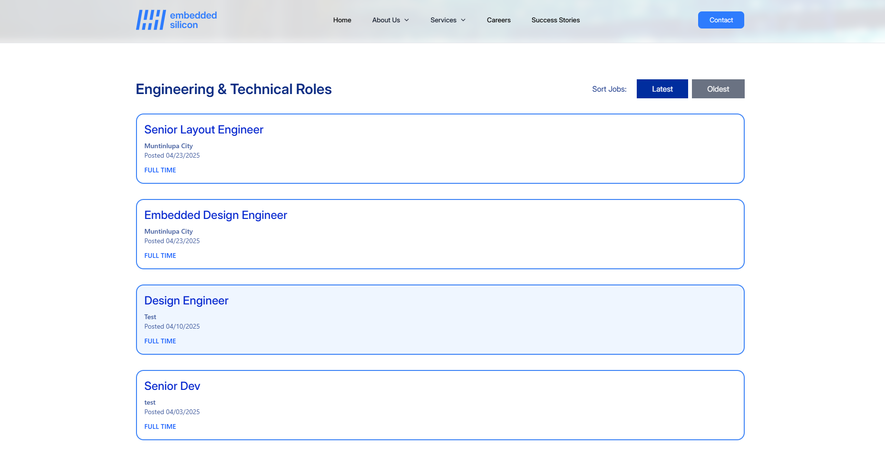

# 🌐 Embedded Silicon Website Revamp

A complete redesign and redevelopment of Embedded Silicon’s official website, built using the MERN stack. The project aimed to modernize the company’s digital presence, streamline content management, and deliver a responsive user experience across devices.

## 🧑‍💻 Project Role

Led the development as part of a two-person on-the-job training (OJT) team. Took charge of both frontend and backend development, including custom CMS integration.

## 🔧 Tech Stack

- **Frontend**: React.js, Tailwind CSS, DaisyUI
- **Backend**: Node.js, Express.js
- **Database**: MongoDB
- **Content Management**: Custom-built CMS for job listings & success stories
- **Deployment**: Vercel / Render (update with your actual host)

## 🚀 Key Features

- 🖥️ **Responsive Design** – Optimized for desktop, tablet, and mobile
- 🧑‍💼 **Dynamic Job Listings** – Easily updatable via the CMS
- 📚 **Success Stories Section** – Showcasing client and team achievements
- 🧠 **CMS Dashboard** – Built-in admin tools for non-tech staff to manage content
- ⚙️ **Scalable MERN Architecture** – Ready for future updates and expansion

## 📸 Screenshots

| Home Page | CMS Admin | Job Listings |
|-----------|------------|---------------|
|  |  |  |

## 🛠️ Local Setup

Clone the repository:

```bash
git clone https://github.com/your-username/embedded-silicon-website.git
cd embedded-silicon-website
